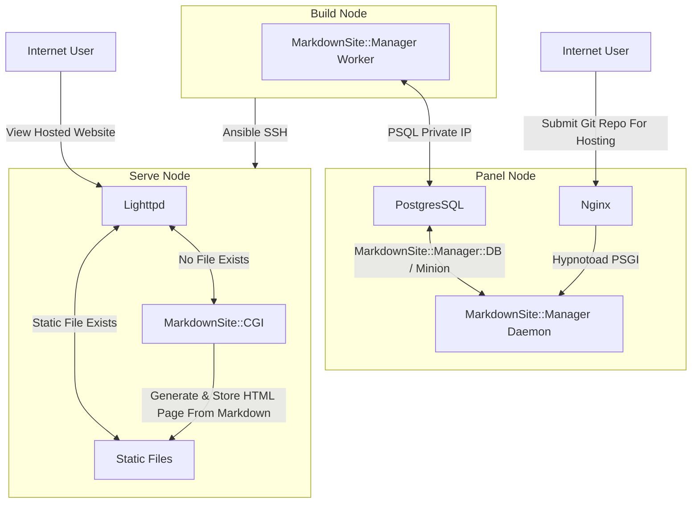

See devops/ for install instructions

## Management Commands

MarkdownSite includes command line tools to manage hosted sites.  These commands are invoked by calling `mds-manager command`.

| Command    | Description                                          |
| ---------- | ---------------------------------------------------- |
| list-sites | Show the id, domain, and repository of hosted sites. |
| edit-site  | Change the configuration of a hosted site.           |
| show-site  | Show the config and build logs for a hosted site.    |
| dbc        | Connect to the DB ( < schema.sql works, too )        |

## Diagram

### Operating Overview

