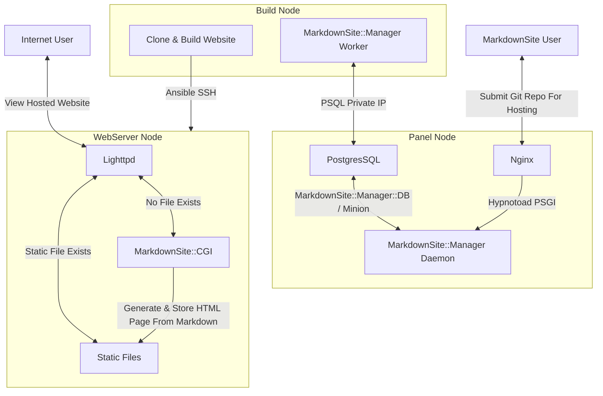

# No Longer Maintained

Please note, this code base is no longer maintained.  For the successor, please see [MyJekyllBlog](https://github.com/symkat/MyJekyllBlog)

## What Is MarkdownSite?

MarkdownSite is a platform for hosting websites.

People who want their websites hosted enter a git url for their repository.

MarkdownSite downloads their repo and turns anything in `public/` into a static website hosted at a random subdomain.

Anything MarkdownSite finds in `site/` that is an `.md` file will be rendered as HTML.

Once MarkdownSite downloads and builds the website, it is sent to one or more webservers and accepts traffic from the Internet.

## How do I use MarkdownSite?

You can use [MarkdownSite](https://markdownsite.com/) to host a website.

You can build your own version of MarkdownSite to host as many websites as you want on your own infrastructure.  See the `devops/` directory for instructions on getting an instance running.

## What are the directories here?

(**NOTE**: MarkdownSite is getting a panel with user accounts! It's being developed right now, so if you want to install MarkdownSite you should use commit e927f46a7d2949c87d2da3182c722486cfe3c4fb, or wait until the the panel development is complete)

**CGI** contains the Markdown::CGI program.  This renders markdown files to HTML, and is installed on the webservers.

**Manager-DB** contains the markdownsite database schema, and the code for MarkdownSite::Manager::DB, a DBIx::Class interface to the database.

**Manager** is MarkdownSite::Manager, a mojolicious-based webapp for submitting the repository and viewing build status.  This contains a Minion worker that handles building and deploying the websites.

**devops/setup** contains an ansible code base to install servers by their server type, and documentation explaining it.

**devops/config** contains an ansible code base that can be maintained and extended -- it is configuration management for an active MarkdownSite instance.

**devops/** contains additional graphs and network diagrams,

## Visual View Of MarkdownSite

This is a birds-eye view of a three-node setup, without insight server.

MarkdownSite has an additional server, insight, that does metrics and graphs with Graphite, Grafana, and Collectd.

## Thanks For Looking!

Thank you for taking the time to checkout this repository.  I hope the information here has been useful.

