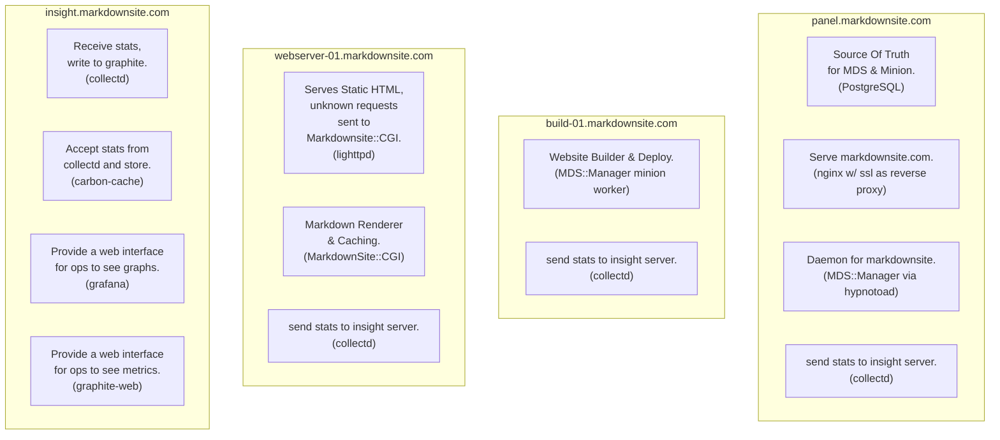
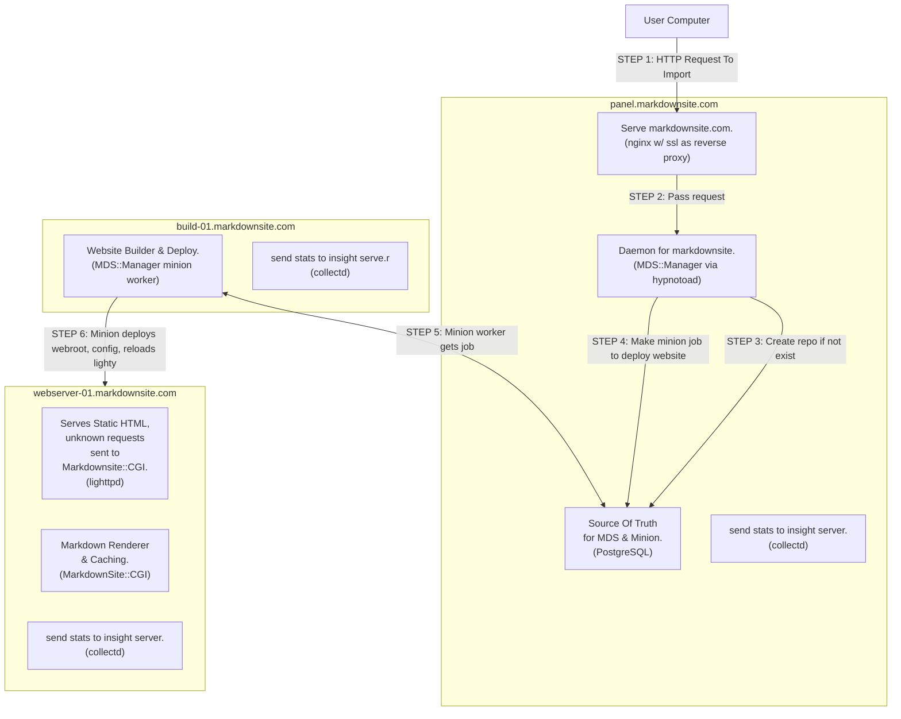
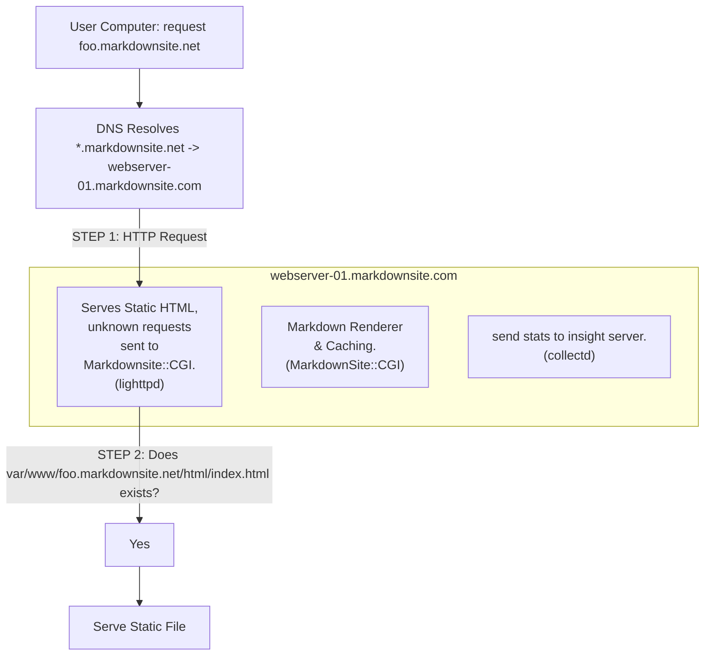
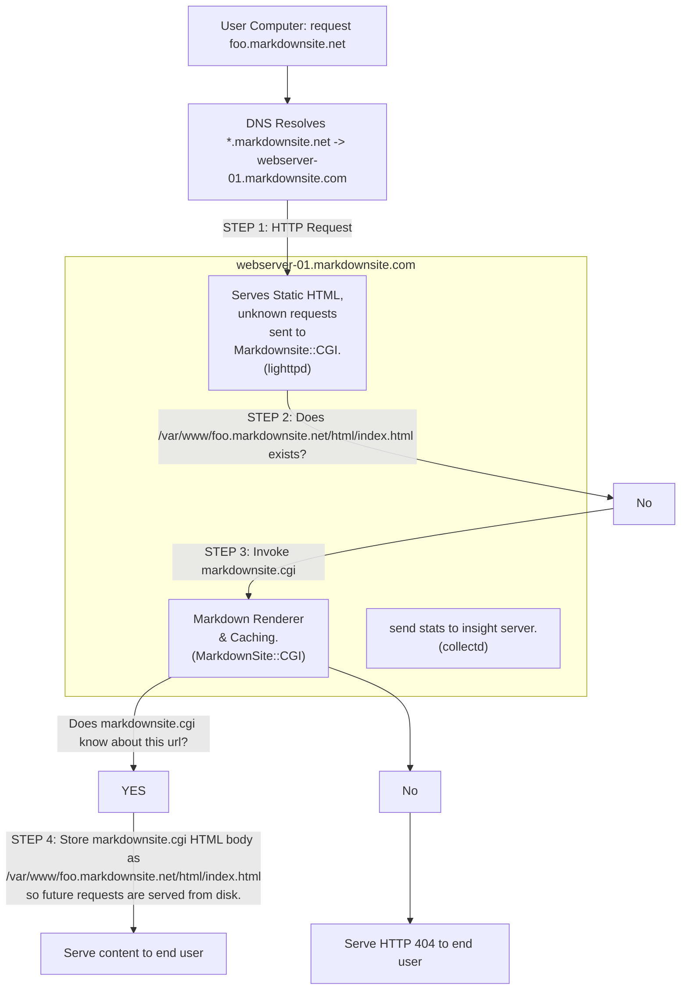

# MarkdownSite Dev/Ops

## Overview

This directory contains devops tools for setting up and maintaining a MarkdownSite installation.

See the `setup/` directory for a guide to getting started with an installation.

See the `config/` directory for a guide to setting up configuration management with ansible.

If you are using this repo to manage a network, you should consider putting the configuration in its own branch and removing the `.gitignore` files that prevent config files from being saved.

## Graphs For Common Events

You will encounter this graph in the `setup/` directory showing the components of the setup.



Below a few graphs will show the interaction of these components to for handling various types of events.

<hr />

### Handle request to build repository



<hr />

### Handle request to serve website

#### If the file exists, the following path will be taken:



<hr />

#### If the file does not exist, the following path will be taken:



## Backup & Restore

### Backing up Grafana

Login to the server and stop the service with `systemctl stop grafana-server`, and then download the `/var/lib/grafana/grafana.db` file.

### Restoring Grafana From Backup

Login to the server and stop the service with `systemctl stop grafana-server`, and then upload the database backup to `/var/lib/grafana/grafana.db` and restart with `systemctl start grafana-server`.

### Backing up MarkdownSite

Login to the panel or a build server and run `mds-manager db-dump > backup-YYYY-MM-DD.sql`.


### Restore MarkdownSite From Backup

Use the `setup/` guide to create a new network.  Replace the `Manager-DB/etc/schema.sql` file with your backup.

## OPs CheatSheet

MarkdownSite includes command line tools to manage hosted sites.  These commands are invoked by calling `mds-manager command` from the panel or build servers.

| Command    | Description                                          |
| ---------- | ---------------------------------------------------- |
| list-sites | Show the id, domain, and repository of hosted sites. |
| edit-site  | Change the configuration of a hosted site.           |
| dbc        | Connect to the DB ( < schema.sql works, too )        |
| db-dump    | Dump the markdownsite DB with pg\_dump               |


When one uses list-stes they will get a listing of the websites:

```bash
manager@panel:~/markdownsite$ mds-manager list-sites
ID   Domain                           Repository
4    vcbodxru.markdownsite.net        https://github.com/Perl/perl5.git
2    os-example.markdownsite.net      git@github.com:symkat/os-example.markdownsite.com.git
3    hugo-example.markdownsite.net    git@github.com:symkat/hugo.markdownsite.net.git
5    4spxrrfv.markdownsite.net        git@github.com:symkat/hello.markdownsite.net.git
```

To get more details on any of the sites, use `edit-site`

```
manager@panel:~/markdownsite$ mds-manager edit-site --site 3
Domain  : hugo-example.markdownsite.net
Repo    : git@github.com:symkat/hugo.markdownsite.net.git
Site id : 3
Created : 2022-03-12 03:23:32
Status: : Enabled

==========================================
                  Config Value   Old   New
==========================================
                build_priority     1     1
                builds_per_day    12    12
               builds_per_hour    10    10
             can_change_domain     1     1
       max_markdown_file_count    20    20
         max_static_file_count   100   100
          max_static_file_size     2     2
       max_static_webroot_size    50    50
      minutes_wait_after_build     0     0
```

Config values can be changed by prepending `--` to them in the command and providing a value.

```bash
manager@panel:~/markdownsite$ mds-manager edit-site --site 3 --minutes_wait_after_build 2
Domain  : hugo-example.markdownsite.net
Repo    : git@github.com:symkat/hugo.markdownsite.net.git
Site id : 3
Created : 2022-03-12 03:23:32
Status: : Enabled

==========================================
                  Config Value   Old   New
==========================================
                build_priority     1     1
                builds_per_day    12    12
               builds_per_hour    10    10
             can_change_domain     1     1
       max_markdown_file_count    20    20
         max_static_file_count   100   100
          max_static_file_size     2     2
       max_static_webroot_size    50    50
      minutes_wait_after_build     0     2
```

If your terminal supports colors, the config lines that changed will be displayed in green.

Commands have associated help files, invoke by calling `--help`

```bash
manager@panel:~/markdownsite$ mds-manager edit-site --help
"/usr/local/bin/mds-manager edit-site <search option>  [--setting value]";

This program shows information about a markdown site and allows
the settings to be edited.

Use a search option to find a site, like --domain foobar.markdownsite.net,
or --site 5 to display the settings for a given site.
...
OPTIONS

These options can be used to change the behavior of the site.

    --max_static_file_count       | How many files a webroot may have.

    --max_static_file_size        | File size limit per file in MiB.
...
```


