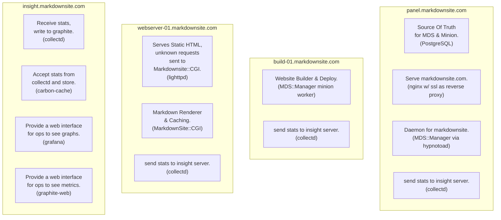
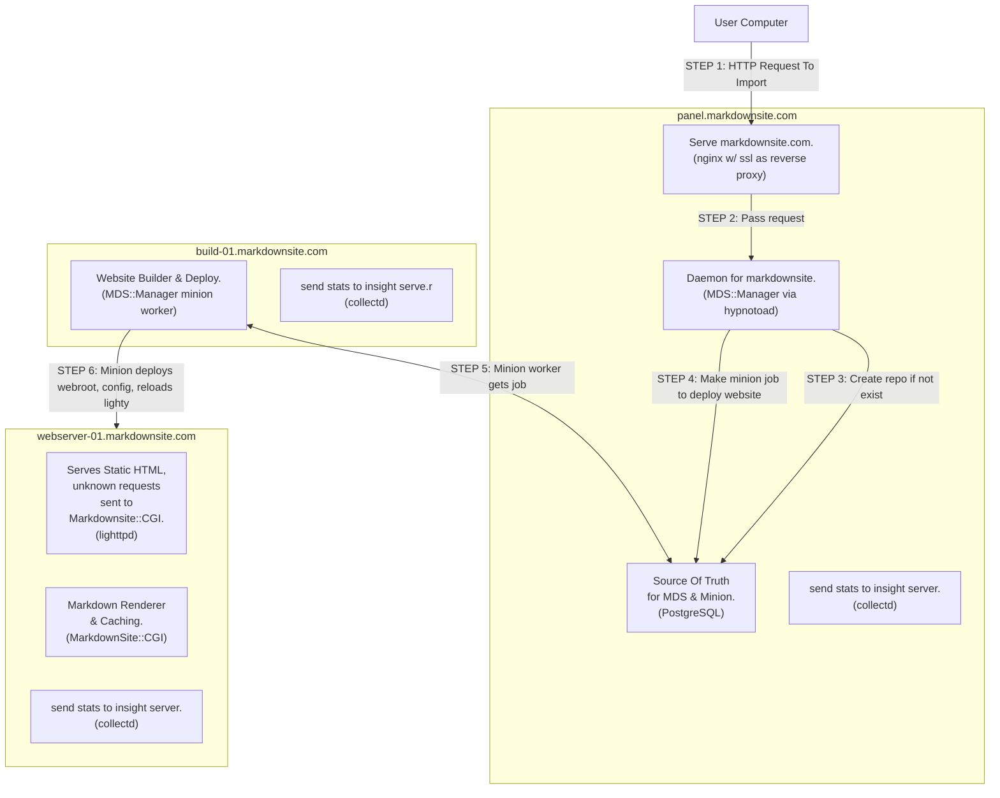
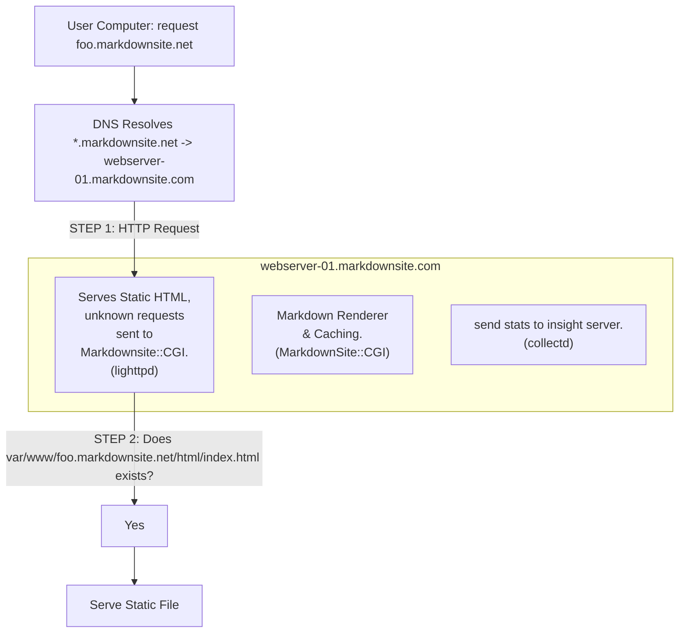
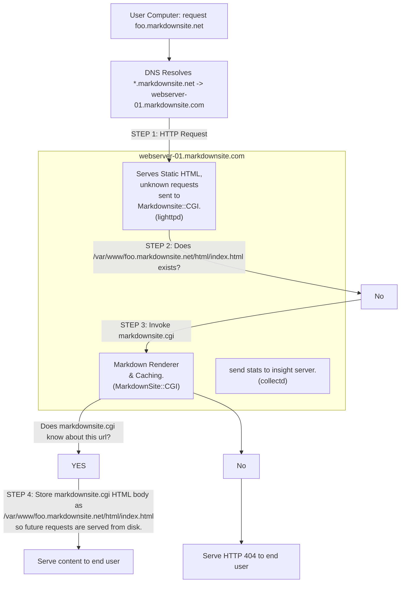

# MarkdownSite Dev/Ops

## Overview

This directory contains devops tools for setting up and maintaining a MarkdownSite installation.

See the `setup/` directory for a guide to getting started with an installation.

See the `config/` directory for a guide to setting up configuration management with ansible.

If you are using this repo to manage a network, you should consider putting the configuration in its own branch and removing the `.gitignore` files that prevent config files from being saved.

## Graphs For Common Events

You will encounter this graph in the `setup/` directory showing the components of the setup.



The following guides explain the relationships in various situations.

### Handle request to build repository



### Handle request to serve website

If the file exists, the following path will be taken:



If the file does not exist, the following path will be taken:




certbot --nginx -d markdownsite.com -d www.markdownsite.com -n --agree-tos --email youATdomain.com
```


## Testing The Setup


## Resetting the DB

The database can be clean reset with the panel-reset-db.yml playbook.

```bash
ansible-playbook -i '45.33.35.224,' panel-reset-db.yml
```

## Backup & Restore

### Backing up Grafana

Login to the server and stop the service with `systemctl stop grafana-server`, and then download the `/var/lib/grafana/grafana.db` file.

### Restoring Grafana From Backup

Login to the server and stop the service with `systemctl stop grafana-server`, and then upload the database backup to `/var/lib/grafana/grafana.db` and restart with `systemctl start grafana-server`.

### Backing up MarkdownSite

Login to the panel or a build server and run `mds-manager db-dump > backup-YYYY-MM-DD.sql`.


### Restore MarkdownSite From Backup

Use the `setup/` guide to create a new network.  Replace the `Manager-DB/etc/schema.sql` file with your backup.

