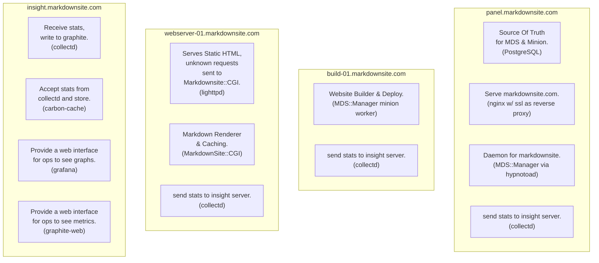

# MarkdownSite Setup Manual

This manual explains the types of machines in a MarkdownSite environment and how to initially setup an environment.  MDS runs on four or more hosts.

## Machine Type Overview

| Server    | Purpose                                                                   |
| --------- | ------------------------------------------------------------------------- |
| Panel     | Hosts MarkdownSite.com, PostgreSQL for site config and minion queue.      |
| Build     | Minion workers: build websites and push them to webservers for hosting.   |
| Webserver | Hosts markdownsites, static generated sites, etc                          |
| Insight   | Graphite, Grafana, Collectd. Receive metrics, graph things, gain insight. |

### Panel

The panel server hosts the actual website that gives the interface for people to submit git repositories to.

The web interface is provided by MarkdownSite::Manager, a Mojolicious application.  The source of truth is a postgresql database named markdownsite.  An additional postgresql database, minion, is used by the Minion job queue.

The database must be accessable from all build nodes.

### Build

The build server runs a minion worker.  The worker is provided by MarkdownSite::Manager.

This server runs jobs that are queued on the minion postgresql database on the Panel host.  It checks out git repositories, performs build steps, and then pushes the complete website to one or more webservers.

This node must have SSH access to WebServer nodes.  This node must have PSQL access to the Panel node.

### WebServer

The WebServer hosts markdownsite and static generated sites.

Sites composed of markdown files use MarkdownSite::CGI to generate and cache HTML versions of their site.  Sites composed of statically generated content are directly served.

Lighttpd is used for the webserver.

### Insight

The Insight server provides a platform for collecting and analysing metrics.  It receives metrics from collectd and writes them to a time series database.  Metrics can be explored with Graphite and Grafana.

## Setup

The initial installation of MarkdownSite is done in this directory using the `setup` script.  The setup script runs ansible roles for the machine type and is customized with the `config.yml` file.

### Design The Network

MarkdownSite should run one panel server, one insight server, and may run any amount of build and webservers.



If one choose, this pattern can be repeated with build nodes expanding out and scaling.  Web server nodes can be expanded out to handle increased network traffic.  This current design requires all webserver nodes to have the same data loaded locally, therefore each webserver must be able to serve the whole of the network traffic itself.  Webserver nodes are load balanced by adding each one as a DNS record.

WebServer nodes can be scaled up by bringing a new, bigger, webserver node up, adding it to the deploy list, running the build\_markdownsite minion job for each domain on the server, and then adding it to the DNS rotation.  The smaller machine can be dropped from DNS, and the server can be removed once the insight server shows no traffic is being served.

### Configure The Setup

As a first step, copy `config.yml.example` to `config.yml`.  Read this file carefully and add your changes.  This file controls all of the initial setup, database configuration, ssh keys, authentication information.  Once it has been written, the network can be setup.


### Setup The Network

The setup script should fully configure a machine.  It takes the machine type, the IP or hostname that SSH can connect to the machine on, and the hostname that the machine should be set to.

Consider the following network, called mysite.com where sites are hosted under subdomains on myhostingside.com.  Some machines in this network are on a private network, but the webserver and insight server are on the public internet.

| Server Type | SSH Host           | Network Hostname        |
| ----------- | ------------------ | ----------------------- |
| Panel       | 192.168.150        | panel.mysite.com        |
| Build       | 192.168.151        | build-01.mysite.com     |
| Insight     | h12j3.somehost.com | insight.mysite.com      |
| WebServer   | h12j4.somehost.com | webserver-01.mysite.com |

If one wanted to build this, after having written `config.yml`, the following commands would do so:

```bash
./setup mds-setup-insight h12j3.somehost.com insight.mysite.com

./setup mds-setup-panel 192.168.150 panel.mysite.com

./setup mds-setup-webserver h12j4.somehost.com webserver-01.mysite.com

./setup mds-setup-build 192.168.151 build-01.mysite.com
```

One would add the following DNS records (using the IP for h12j3.somehost.com and h12j4.somehost.com):

| Record                | Type | Value              |
| --------------------- | ---- | ------------------ |
| panel.mysite.com      | A    | 192.168.150        |
| build-01.mysite.com   | A    | 192.168.151        |
| insight.mysite.com    | A    | h12j3.somehost.com |
| graphite.mysite.com   | A    | h12j3.somehost.com |
| grafana.mysite.com    | A    | h12j3.somehost.com |
| \*.myhostingside.com  | A    | h12j4.somehost.com |

In this way, graphite and grafana are hosted on their own subdomains, and all subdomains for myhostingside.com resolve to the webserver-01 node.  Folks on the private network can access the panel node to add markdownsites, but it isn't on the public internet.  You could put them all on the Internet, or host them all on a private network, or whatever combination works for you.

### Enable Monitoring & Metrics

Once the network is setup, collectd is left unconfigured.  This is because machines may be added or removed from the network, and the job of configuring collectd on an on-going basis is more for configuration management than for one-shot setups like this directory.

See the directory ../config to continue with enabling monitoring and metrics.

### Testing That It All Works

If all is well:

1. The panel will be accessable and a git repository can be added.
2. Once submitted, it will show a status page and build progress for the repo.
3. The minion job will have completed successfully.
4. The build website will be accessable.

## Wrappping Up

The network should now be up and handling traffic.

## Trouble Shooting


