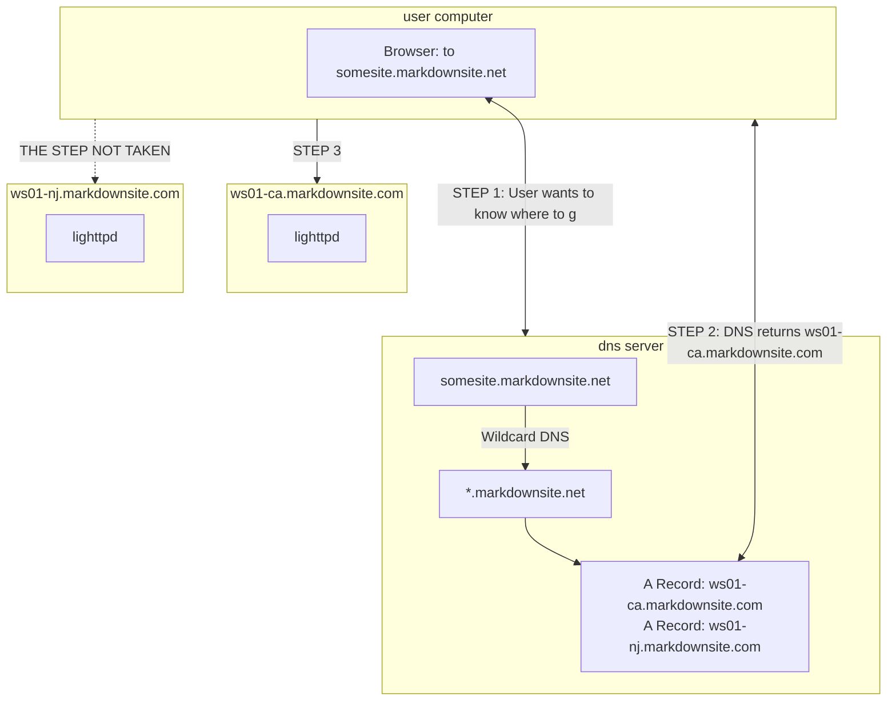

# MarkdownSite Development Guide

This guidebook attempts to help one understand working on the various systems in MarkdownSite.  It is a work in progress, and I invite you to make pull requests to help clarify and expand it.

## WebServer

MarkdownSite serves user websites on `*.markdownsite.net`.  This is a unique domain for responding to HTTP(S) requests.  Those requests all come to a WebServer.

The WebServer can be run in isolation from every other part of the network. No other MarkdownSite machine needs need to be installed for most development work.

### Install Development Server

Bring up a Debian 11 machine.  Ensure that you have ssh access to it as root.  Make note of the IP address of the machine.

Ensure that the machine you have this repo checked out to has ansible installed so that you can run `ansible-playbook`.

Run the following:

```bash
./setup mds-setup-webserver ip.of.debian11.machine.goes.here mds-webdev
```

### Understanding MarkdownSite WebServer

MarkdownSite takes advantage of Wildcard DNS to capture all subdomains of `markdownsite.net` by having a CNAME record on `*.markdownsite.net` that points to `markdownsite.net`

Then MarkdownSite uses Round Robin DNS to split the load between a server in California and a server in New Jersey by having an A record for each webserver node on `markdownsite.net`.


#### Requests

When a request comes into lighttpd, it can either be served from a static file, or it will be redirected to MarkdownSite::CGI.

A webroot is used as `/var/www/domain/html/`, and the first file found is served.  If no file is found, then MarkdownSite::CGI is invoked.  There are five possible targets for a given request.

1. The file itself
2. The file, appended with '.html'
3. The file, appended with '.htm'
4. The file, appended with '/index.html'
5. The file, appended with '/index.htm'

If none of these are true, the request is handed off to `markdownsite.cgi`.  These rules are all defined in `/etc/lighttpd/rewrite.lua`

These tables give examples of requests and their static file mappings.

| Path Requested | Files Checked                                                            |
| -------------- | ------------------------------------------------------------------------ |
| site.com       | /var/www/site.com/html checked (always fails, is a directory not a file) |
| site.com       | /var/www/site.com/html.html checked                                      |
| site.com       | /var/www/site.com/html.htm checked                                       |
| site.com       | /var/www/site.com/html/index.html checked                                |
| site.com       | /var/www/site.com/html/index.htm checked                                 |
| site.com       | MarkdownSite::CGI accepts request                                        |


| Path Requested | Files Checked                                    |
| -------------- | ------------------------------------------------ |
| site.com/about | /var/www/site.com/html/about checked             |
| site.com/about | /var/www/site.com/html/about.html checked        |
| site.com/about | /var/www/site.com/html/about.htm checked         |
| site.com/about | /var/www/site.com/html/about/index.html checked  |
| site.com/about | /var/www/site.com/html/about/index.htm checked   |
| site.com       | MarkdownSite::CGI accepts request                |


| Path Requested      | Files Checked                                |
| ------------------- | -------------------------------------------- |
| site.com/about.html | /var/www/site.com/html/about.html            |
| site.com/about.html | /var/www/site.com/html/about.html.html       |
| site.com/about.html | /var/www/site.com/html/about.html.htm        |
| site.com/about.html | /var/www/site.com/html/about.html/index.html |
| site.com/about.html | /var/www/site.com/html/about.html/index.htm  |
| site.com/about.html | /var/www/site.com/html/about.html            |
| site.com/about.html | MarkdownSite::CGI accepts request            |


<br />

MarkdownSite::CGI reads files from `/var/www/site.com/pages/` and then the request path.

If the request path is a directory, and index.md exists it will be returned (and then cached for the next request)

If the request path, changing `.html` or `.htm` for `.md`, exists it will be returned (and then cached for the next request).

If the request path does not map to a file, a 404 will be returned.

Cached files are cleared when a site is rebuilt.

### Doing Development

It is assumed at this point that a machine has been brought up using the `setup/` system, and that the developer has a root shell on it.

There will be no configuration for any website on it, so drop one in like the following:

```conf
$HTTP["host"] =~ "^hello.mds$" {
    server.document-root = "/var/www/hello.mds/html"

    server.errorlog      = "/var/log/lighttpd/hello.mds.error.log"
    accesslog.filename   = "/var/log/lighttpd/hello.mds.access.log"

    magnet.attract-physical-path-to = ( "/etc/lighttpd/rewrite.lua" )
}
```

Setup a bit:

```bash
mkdir -p /var/www/hello.mds/{html,pages}; 
echo "Hello World"    > /var/www/hello.mds/html/index.html; 
echo 'Hello, *world*' > /var/www/hello.mds/pages/markdown.md; 
chown -R www-data.www-data /var/www/hello.mds
```

Once this is done, restart lighttpd: `systemctl restart lighttpd`

Confirm the config loaded and everything is fine: `journalctl -fu lighttpd`

If everything has done well, the following should work:

`curl --header "Host: hello.mds" http://ip.of.dev.box/` -- Show "Hello World"

`curl --header "Host: hello.mds" http://ip.of.dev.box/markdown.html` -- Show a rendered page

#### Helpful Commands

```bash
# Get an strace on lighttpd
strace -p $(ps aux | grep -v grep | grep "local/sbin/lighttpd"  | awk '{print $2}')
```


