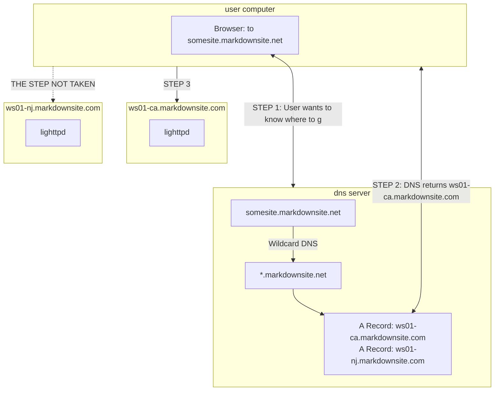
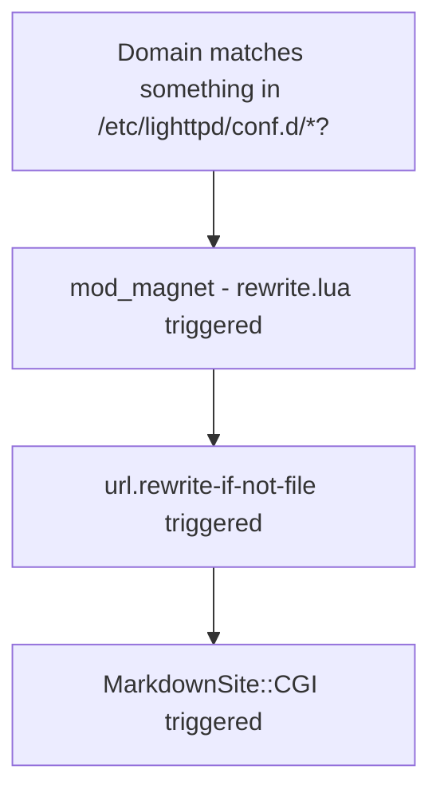
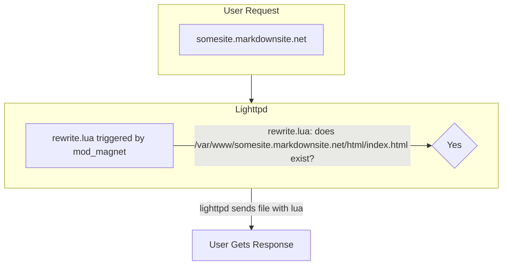
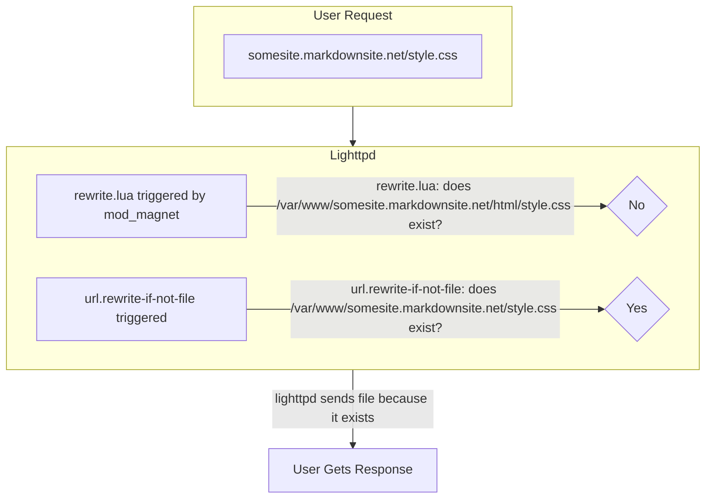
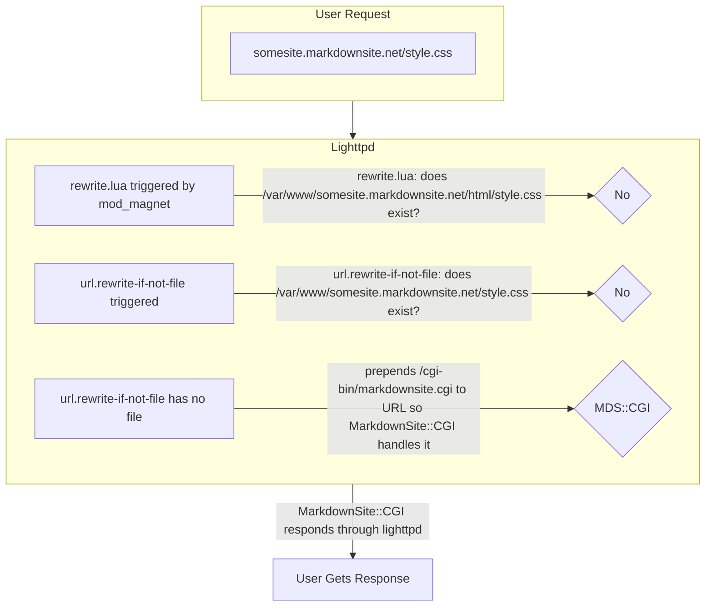

# MarkdownSite Development Guide

This guidebook attempts to help one understand working on the various systems in MarkdownSite.  It is a work in progress, and I invite you to make pull requests to help clarify and expand it.

## WebServer

MarkdownSite serves user websites on `*.markdownsite.net`.  This is a unique domain for responding to HTTP(S) requests.  Those requests all come to a WebServer.

The WebServer can be run in isolation from every other part of the network. No other MarkdownSite machine needs need to be installed for most development work.

### Install Development Server

Bring up a Debian 11 machine.  Ensure that you have ssh access to it as root.  Make note of the IP address of the machine.

Ensure that the machine you have this repo checked out to has ansible installed so that you can run `ansible-playbook`.

Run the following:

```bash
./setup mds-setup-webserver ip.of.debian11.machine.goes.here mds-webdev
```

### Understanding MarkdownSite WebServer

MarkdownSite takes advantage of Wildcard DNS to capture all subdomains of `markdownsite.net` by having a CNAME record on `*.markdownsite.net` that points to `markdownsite.net`

Then MarkdownSite uses Round Robin DNS to split the load between a server in California and a server in New Jersey by having an A record for each webserver node on `markdownsite.net`.


#### Requests

When a request comes into lighttp, there are a handful of paths it could take.

A webroot is used as `/var/www/domain/html/`.

If there is a static file that maps to the request, it is directly served.

There are a few particulars about how file resolution currently happens.  Directories are not well-respected.  It is usual for `index.html` files, or `index.htm` files and so on to be sent when one requests a directory path.




This is the path a request will take through lighttpd.  Each step could change the response.  If the domain doesn't exist as a configuration file, then the default lighttpd config will be used.  If mod\_magnet returns a file to send to the user, the remaining steps will not be taken.

##### mod\_magnet handles it (/index.html on directories)


<br />

##### url.rewrite-if-not-file handles it (static files only, no directory handling)



<br />

##### MarkdownSite::CGI handles it (no static file existed)



<br />

### Doing Development

It is assumed at this point that a machine has been brought up using the `setup/` system, and that the developer has a root shell on it.

There will be no configuration for any website on it, so drop one in like the following:

```conf
$HTTP["host"] =~ "^hello.mds$" {
    server.document-root = "/var/www/hello.mds/html"

    server.errorlog      = "/var/log/lighttpd/hello.mds.error.log"
    accesslog.filename   = "/var/log/lighttpd/hello.mds.access.log"

    magnet.attract-physical-path-to = ( "/etc/lighttpd/rewrite.lua" )

    url.rewrite-if-not-file = (
        "^(/.*)$" => "/cgi-bin/markdownsite.cgi$1"
    )
}
```

Setup a bit:

```bash
mkdir -p /var/www/hello.mds/{html,pages}; 
echo "Hello World"    > /var/www/hello.mds/html/index.html; 
echo 'Hello, *world*' > /var/www/hello.mds/pages/markdown.md; 
chown -R www-data.www-data /var/www/hello.mds
```

Once this is done, restart lighttpd: `systemctl restart lighttpd`

Confirm the config loaded and everything is fine: `journalctl -fu lighttpd`

If everything has done well, the following should work:

`curl --header "Host: hello.mds" http://ip.of.dev.box/` -- Show "Hello World"

`curl --header "Host: hello.mds" http://ip.of.dev.box/markdown.html` -- Show a rendered page

#### Secret Routes

All MarkdownSite pages have two routes in them by default.  One is `mds.status` and it will show you information about a domain:

```
$ curl --header "Host: hello.mds" http://your.ip.here/mds.status 2>/dev/null| json_pp
{
   "domain" : "hello.mds",
   "routes" : {
      "/about.html" : "/var/www/hello.mds/pages/about.md",
      "/markdown.html" : "/var/www/hello.mds/pages/markdown.md"
   }
}
```

Another is `mds.flush`.

It is an expensive operation to figure out the routes for a website.  Each markdown page must be scanned initially, since the data in them can configure the route just as much -- and more so -- than the file name.  If it is the first time MarkdownSite::CGI is running for the site, it will complete this operation and store the routing information in memcached.  Subsequent requests will use this already-known information to route the request.

The `mds.flush` route will purge this information from memcached so that the next run will regenerate it.

```bash
$ curl -XPOST -d '{}' --header "Host: hello.mds" http://your.ip.here/mds.flush
{"status":1}
```


